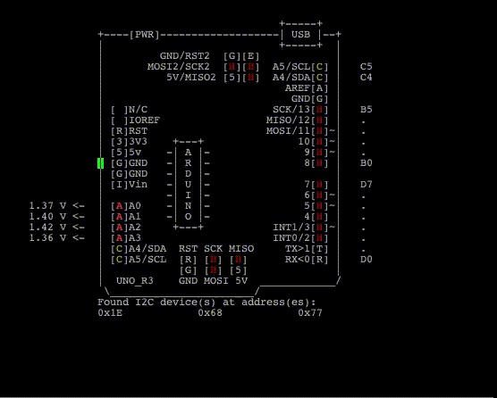

# AsciiDuinoDisplay

https://www.youtube.com/shorts/d5-irlc9g9A

## Introduction
AsciiDuinoDisplay is an innovative project dedicated to bringing ASCII art to life on Arduino UNO. This project harnesses the simplicity of ASCII art and the versatility of Arduino to create dynamic, visually appealing displays using just characters. It's perfect for hobbyists, educators, and anyone interested in exploring the intersection of art and technology.

## Features
- Dynamic ASCII art rendering on Arduino UNO.
- Real-time ASCII art updates based on sensor inputs.

## Getting Started
### Prerequisites
- An Arduino UNO board.
- Arduino IDE installed on your computer ([Download here](https://www.arduino.cc/en/Main/Software)).
- A USB cable to connect the Arduino to your computer.

### Installation
1. Clone this repository or download the source code.
2. Open the `.ino` file using the Arduino IDE.
3. Connect your Arduino UNO to your computer using the USB cable.
4. Select the correct board and port in the Arduino IDE.
5. Upload the sketch to your Arduino UNO.

## Usage
Once the sketch is uploaded, the Arduino will start displaying ASCII art.

### Viewing ASCII Art
To view the ASCII art in its intended format, we recommend using a terminal emulator that supports ANSI escape sequences, such as PuTTY or Tera Term. The Arduino IDE's built-in Serial Monitor does not support these sequences, which might result in incorrect display formatting.

#### Configuring PuTTY for Best Results
1. Download and open PuTTY ([Download here](https://www.putty.org/)).
2. In the 'Session' category, select 'Serial', and enter the correct COM port for your Arduino.
3. Under 'Connection > Serial', set the baud rate to match the rate in your Arduino sketch (usually 115200).
4. Open the connection and enjoy the ASCII art display.

## Contributing
Contributions to AsciiDuinoDisplay are always welcome. Whether it's bug fixes, feature enhancements, or documentation improvements, feel free to fork this repository and submit a pull request.

## Acknowledgments
- Thanks to the Arduino community for continuous inspiration and support. (http://busyducks.com/wp_4_1/2015/11/16/ascii-art-arduino-pinouts/)
- Github(https://github.com/busyDuckman/ascii-art-arduinos)
- Special thanks to [ASCII Art Archive](https://www.asciiart.eu/) for providing a wide array of ASCII art examples.

---

**Note:** This project is intended for educational and hobbyist purposes and is not suited for commercial use.
